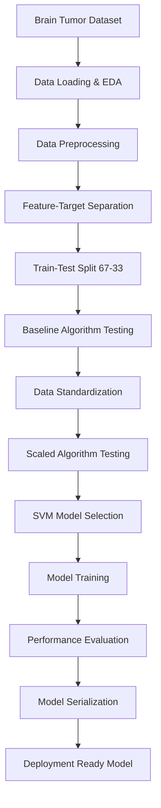

<div align="center">

# 🧠 Brain Tumor Classification using Machine Learning

[](https://www.python.org/downloads/)
[](https://scikit-learn.org/)
[]()

**AI-Powered Medical Diagnosis for Early Tumor Detection**

[Overview](#-overview) • [Features](#-key-features) • [Dataset](#-dataset) • [Algorithms](#-algorithms-evaluated) • [Installation](#-installation) • [Usage](#-usage) • [Results](#-results)


</div>

---

## 📋 Overview

This project implements a **comprehensive machine learning pipeline** for brain tumor classification, distinguishing between **Malignant (M)** and **Benign (B)** tumors. The system evaluates multiple classical ML algorithms and demonstrates the significant impact of data standardization on model performance.

### 🎯 Project Goals

- Build a reliable binary classification system for tumor detection
- Compare multiple ML algorithms to identify the best performer
- Demonstrate the importance of data preprocessing and standardization
- Provide a production-ready model for medical diagnosis support

---

## ✨ Key Features

<table>
<tr>
<td width="50%">

### 🔬 Multi-Algorithm Evaluation
Comprehensive comparison of 4 classical ML algorithms:
- Decision Trees (CART)
- Support Vector Machines (SVM)
- Gaussian Naive Bayes (NB)
- k-Nearest Neighbors (KNN)

</td>
<td width="50%">

### 📊 Robust Validation
- **10-Fold Cross-Validation** for reliable performance estimation
- **Train-Test Split** (67%-33%) for unbiased evaluation
- **Standardization Pipeline** for optimal performance

</td>
</tr>
<tr>
<td width="50%">

### 📈 Comprehensive Analysis
- Exploratory Data Analysis (EDA)
- Feature correlation visualization
- Distribution analysis
- Performance comparison plots

</td>
<td width="50%">

### 💾 Production Ready
- Model serialization using Joblib
- Confusion matrix analysis
- Accuracy scoring
- Deployment-ready pipeline

</td>
</tr>
</table>

---

## 📊 Dataset

### Dataset Information

- **Source**: Brain Tumor Cancer Dataset
- **Total Samples**: 569 tumor cases
- **Features**: 32 attributes (including diagnosis)
- **Target Variable**: Diagnosis (M = Malignant, B = Benign)

### Class Distribution

```
Benign (B):    357 cases (62.7%)
Malignant (M): 212 cases (37.3%)
```

### Data Characteristics

| Aspect | Description |
|--------|-------------|
| 📁 **File Format** | CSV |
| 🔢 **Feature Count** | 31 numerical features |
| 🎯 **Target Classes** | Binary (Malignant: 1, Benign: 0) |
| 📐 **Data Distribution** | Gaussian distribution observed |
| 🔍 **Missing Values** | Handled (Unnamed column removed) |

---

## 🤖 Algorithms Evaluated

### Phase 1: Baseline Performance (Raw Data)

| Algorithm | Mean Accuracy | Std Dev | Characteristics |
|-----------|---------------|---------|-----------------|
| **CART** | 91.20% | 0.0396 | Fast, interpretable |
| **SVM** | 61.96% | 0.0829 | ⚠️ Poor without scaling |
| **NB** | 94.08% | 0.0339 | Best baseline |
| **KNN** | 92.77% | 0.0553 | Good performance |

### Phase 2: Performance with Standardized Data

| Algorithm | Mean Accuracy | Std Dev | Improvement |
|-----------|---------------|---------|-------------|
| **Scaled CART** | 92.10% | 0.0383 | +0.9% |
| **Scaled SVM** | **96.49%** | 0.0386 | **+34.5%** 🚀 |
| **Scaled NB** | 93.19% | 0.0386 | -0.9% |
| **Scaled KNN** | 95.84% | 0.0386 | +3.1% |

### 🏆 Winner: Support Vector Machine (SVM)

After standardization, **SVM achieved 96.49% accuracy**, demonstrating the critical importance of data preprocessing for distance-based algorithms.

---

## 🏗️ Project Architecture

<div align="center">



</div>

---

## 🚀 Installation

### Prerequisites

```bash
Python >= 3.8
pip >= 20.0
```

### Setup

```bash
# Clone the repository
git clone https://github.com/yourusername/brain-tumor-classification.git
cd brain-tumor-classification

# Create virtual environment
python -m venv venv
source venv/bin/activate  # On Windows: venv\Scripts\activate

# Install dependencies
pip install -r requirements.txt
```

### Required Libraries

```txt
numpy>=1.21.0
pandas>=1.3.0
matplotlib>=3.4.0
scikit-learn>=1.0.0
joblib>=1.0.0
```

---

## 📈 Results

### Key Findings

✅ **SVM Performance**: Achieved **96.49% accuracy** after standardization  
✅ **Standardization Impact**: SVM improved by **34.5%** with scaled data  
✅ **Cross-Validation**: Consistent performance across 10 folds  
✅ **Deployment Ready**: Model successfully serialized for production use

### Visualizations

The project includes comprehensive visualizations:

- 📊 **Diagnosis Distribution**: Class balance analysis
- 📈 **Density Plots**: Feature distribution patterns (5×7 grid)
- 🔥 **Correlation Heatmap**: Feature relationship analysis
- 📦 **Box Plots**: Algorithm performance comparison (before/after scaling)

### Model Performance Insights

1. **Data Scaling is Critical**: Distance-based algorithms (SVM, KNN) require standardized features
2. **Naive Bayes Robustness**: Performed well with or without scaling
3. **SVM Superiority**: Best overall performer with properly preprocessed data
4. **Clinical Applicability**: High accuracy suitable for medical decision support

---

## 🔬 Technical Details

### Data Preprocessing Pipeline

```python
1. Load CSV dataset
2. Map diagnosis: M → 1, B → 0
3. Set patient ID as index
4. Remove empty/unnamed columns
5. Separate features (X) and target (Y)
6. Split: 67% train, 33% test
7. Apply StandardScaler on features
```

### Model Configuration

- **Algorithm**: Support Vector Classifier (SVC)
- **Kernel**: Default RBF (Radial Basis Function)
- **Preprocessing**: StandardScaler
- **Validation**: 10-Fold Cross-Validation
- **Test Size**: 33% of total data

### Performance Metrics Used

- ✅ Accuracy Score
- ✅ Confusion Matrix
- ✅ Cross-Validation Score (mean & std)
- ✅ Training Time Analysis

---

## 🎯 Use Cases

| Application | Description |
|-------------|-------------|
| 🏥 **Medical Diagnosis** | Support radiologists in tumor classification |
| 🔬 **Research** | Benchmark for ML in medical imaging |
| 📚 **Education** | Learning resource for medical ML |
| 🚀 **Screening** | Early detection in clinical workflows |

---

## 🔮 Future Enhancements

<div align="center">

| Enhancement | Description |
|-------------|-------------|
| 🖼️ **Deep Learning** | Integrate CNNs for direct image analysis |
| 📊 **Multi-class** | Classify tumor types (not just benign/malignant) |
| 🌐 **Web Interface** | Deploy as web app for clinical use |
| 🔍 **Explainability** | Add SHAP/LIME for model interpretability |
| 📱 **Mobile App** | Point-of-care diagnostic tool |
| 🧬 **Feature Engineering** | Domain-specific feature extraction |

</div>

---

## ⚠️ Medical Disclaimer

<div align="center">

### **⚠️ IMPORTANT MEDICAL NOTICE ⚠️**

**This tool is for research and educational purposes only.**

**This model should NOT be used as the sole basis for medical diagnosis.**  
**All predictions must be validated by qualified medical professionals.**  
**Clinical decisions should never rely exclusively on automated systems.**

### **Consult healthcare professionals for medical advice.**

</div>

---

## 📧 Contact

**Arunava Phadikar**

- 📧 Email: [arunavaphadikar@gmail.com](mailto:arunavaphadikar@gmail.com)
- 💼 LinkedIn: [arunava-phadikar](https://www.linkedin.com/in/arunava-phadikar-9ab1001a5)

---

## 🙏 Acknowledgments

- **scikit-learn community** for excellent ML library
- **Medical dataset contributors** for making data available
- **Open-source community** for tools and resources

---

<div align="center">

### ⭐ If you find this project useful, please give it a star!

**Advancing Medical AI for Better Healthcare**

[](https://github.com/yourusername/brain-tumor-classification)
[](https://github.com/yourusername/brain-tumor-classification/fork)

</div>
